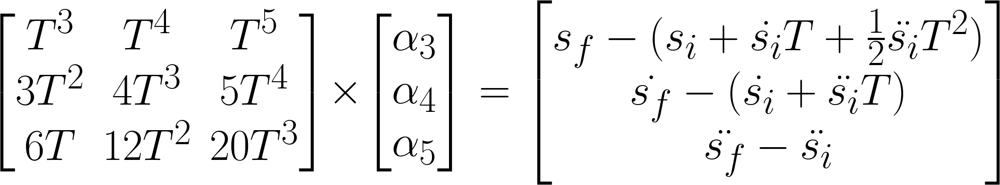

# Self-Driving Car Nanodegree Path Planning Project

## Summary
I created a path planner for a self-driving car driving on a simulated highway with other vehicles. I used a combination of a finite state machine, jerk minimizing trajectories, and cost functions to weight each one of the generated trajectories in order to make the car drive itself.

## Finite State Machine

I used the FSM model below to control the planning of the vehicle. The dotted transitions are only possible if their respective conditions are met. These conditions are necessary so that the vehicle stays on the right side of the double yellow line divider. Lane 0 is the leftmost lane to the right of the median, while lane 2 is the rightmost lane. 

In the keep lane state, the ego vehicle accelerates within its lane until it reaches just below the speed limit of 50 mph if there are no cars directly in front of it in the same lane. If there are cars present in front of it, it matches the speed of them. The other two states do exactly as their names suggest.

## Jerk Minimizing Trajectory
In order to generate "smooth" trajectories for each of the three states given above, I calculated jerk minimizing trajectories in Frenet coordinates. I had to convert these points back to cartesian in order to pass them to the simulator. I found that the provided function to do this resulted in non-optimal trajectories that exceeded acceleration and jerk limits. So I instead used the method described in [this blogpost](https://towardsdatascience.com/teaching-cars-to-drive-highway-path-planning-109c49f9f86c) under the 'Creating Smoother Trajectories' section.

To generate these trajectories I had to solve the following matrix equations, shown only for the `s` coordinate but I had to do the same for `d` (follow [this](https://www.selfdrivingcars360.com/glossary/frenet-coordinates/) link if you are unfamiliar with Frenet terminology). The `s` quantities on the right-hand side of the equations can are position, velocity, and acceleration boundary conditons. The i and f subscripts stand for initial and final, respectively. The uppercase `T` represents the desired amount of time you would like the vehicle to complete the trajectory. 

Once I solved for the alpha coefficients, I could plug them into the below equations for position, velocity, and acceleration at any given time within the trajectory. An additional derivate applied on the last equation can also, yield the instantaneous jerk.

In order to remain within the provided acceleration and jerk limits I employed the following procedure. I started with an optimistic estimate of `T` with the equation `Tmin= final_velocity/desired_change_in_position`. I then iteratively incremented this value while checking the above equations until I landed on a trajectory that did not violate any of the required constraints.

## Cost Functions

I used three cost functions described below

- **Following cost**: Penalizes trajectories where there is a car in the destination lane at most 30 meters in front of the ego vehicle. The closer this cars is, the larger the penalty. The cost is computed in the formula `(30-following_distance)/30`, where `following_distance` is the distance the ego vehicle is behind the closest vehicle in front of it in the destination lane within 30 meters. It is set to 0 if there is no vehicle in this range

- **Lane change cost**: For lane change trajectories, set equal to 1 if there is a 12 meter distance between any car in the destination lane, in front or behind the ego vehicle. Set equal to 0 if there is no such gap or the trajectory corresponds the keep lane state.

- **Out of bounds cost**: Set equal to 1 if the trajectory contains any coordinates that are outside the legally driveable area, i.e. to the left of the yellow median and to the right of the rightmost lane. Else set equal to zero.

I weighted the first two cost functions equally with a weight of 1 and weighted the last one more heavily with a weight of 1000. My reasoning for this weighting was that I did not find that out-of-bounds incidents to happen very frequently, so I wanted that cost function to outweight the others when it did happen.

## Build Instructions

1. Clone this repo.
2. make directory and compile `build.sh`
4. Run it: `./run.sh`

## Results

A Youtube video of the results can be seen [here](https://youtu.be/bmuct_5RsP8).

